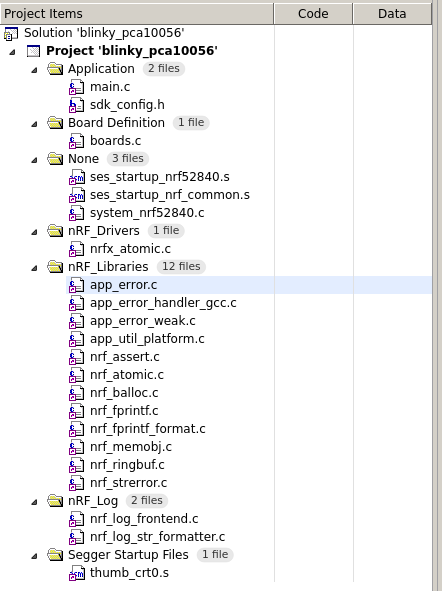

This is long, and some of it is going to sound like a rant. I don't
want to be down on Nordic about this, but the nRF5 SDK is really hard
to use in a productive way. The SDK code itself isn't the problem,
it's the configuration system for including the right SDK files and
setting the relevant configuration options. Or rather the lack of a
coherent system for doing that...

# Installation

If you start at the [main nRF52840
page](https://www.nordicsemi.com/Products/Low-power-short-range-wireless/nRF52840)
on the Nordic Semi website, after a bit of poking around, you get to
the [IDEs and toolchains
page](https://www.nordicsemi.com/Software-and-tools/Development-Tools/IDEs-and-Toolchains)
where the SEGGER Embedded Studio is (sort of) recommended for use.

[SEGGER Embedded
Studio](https://www.segger.com/products/development-tools/embedded-studio/)
(SES) is a commercial product that's free for use with Nordic Semi
devices (see the section headed "Free Commercial Use License" [here](
https://www.segger.com/products/development-tools/embedded-studio/license/licensing-conditions/)).
During installation it's not immediately obvious that this kind of
licensing applies, but it's there on their website.

## IDE (SEGGER Embedded Studio)

From the [SES downloads
 page](https://www.segger.com/downloads/embedded-studio/) you can
download SES for ARM -- it's available for Windows, MacOS and Linux.
I'm working on Linux, and the download is about 344 Mb.

The install bundle for Linux comes as a single tarball containing an
installation program and instructions. The installation program has to
be run as root, which is not so good. (I think the root requirement is
just because the installer sets up some `udev` rules for talking to
J-Link debuggers. You can see them in
`/etc/udev/rules.d/99-jlink.rules` after installation.)

The installation takes up 1.2 Gb of disk space once it's there, and
includes builds of GCC and LLVM for ARM. The first time you start the
Embedded Studio application, you're offered the option of activating a
free license to use the software for development with Nordic devices.

You also need to download the nRF5 SDK, which comes in a confusing
array of versions. For Bluetooth-only development, you can use the
vanilla nRF5 SDK (current version is 16.0.0). You also need to get a
couple of "SoftDevices", Nordic's name for the binary-only drivers
they provide for some networking functionality. You can get all this
from the [nRF5 SDK download page](https://www.nordicsemi.com/Software-and-tools/Software/nRF5-SDK/Download).

For developing applications that use Thread or Zigbee, you need to get
the nRF5 SDK for Thread and Zigbee instead. We'll deal with that
later, if my motivation survives to those later examples
(flash-forward to the future: it doesn't...).

The SoftDevice + nRF5 SDK download unpacks to about 750 Mb.


# Documentation

All of Nordic's developer documentation is on a slightly old-fashioned
looking website they call their Infocenter. It's not terrible, but
it's not that great either. For example, the board identifiers used
for Nordic development kits and dongles are things like PCA10056 (the
nRF52840 development kit), PCA10059 (the nRF52840 dongle) and so on.
There are some mysterious looking directories in the examples called
`pca10056e`. Searching in the documentation doesn't reveal anything
useful at all. Searching on the Nordic discussion forums finds one
note that it's something to do with an emulator running on some other
platform, but the link to the explanation from that note is broken.
There's lots of that sort of stuff, and it generally takes a long time
to find anything.

There are lots of examples, which is definitely good, and there is
documentation for each example on the Infocenter (for example, [this
Bluetooth
one](https://infocenter.nordicsemi.com/topic/sdk_nrf5_v16.0.0/ble_sdk_app_hrc.html)
or the [classic
blinky](https://infocenter.nordicsemi.com/topic/sdk_nrf5_v16.0.0/gpio_example.html)).
The way the examples are set up is kind of annoying, as we'll see
below, but they do serve as a good basis to start from. That's
important, because I wouldn't want to try to start a project with the
nRF5 SDK from a blank slate.


# Example 1: Blinky (`example-1`)

If you look in the `examples/peripheral/blinky` directory of the nRF5
SDK, you'll find the following:

 - `hex`: a directory containing Intel hex files for the compiled
   example for a number of platforms;
 - `blinky.eww`: this is something to do with the Keil IDE, I think --
   no idea why it's here at the top level of this example;
 - `main.c`: the example code, 77 lines, of which only 16 are code;
 - `pca10040`, `pca10040e`, `pca10056`, `pca10056e`, `pca10059`:
   directories with configuration and build files for different
   platforms.

This is how all the examples look. Those platform directories use the
board IDs that Nordic uses to refer to the development kits. For our
purposes, the only important ones are `pca10056` (the nRF52840
development kit) and `pca10059` (the nRF52840 dongle). There are also
sub-directories of these directories that refer for configurations
with (`mbr`) and without (`blank`) a bootloader, but we'll not worry
about that.

Each of the platform directories includes a `config` directory (we'll
come to that in a minute...) and a directory for each of the supported
build systems (`ses` for SEGGER Embedded Studio, `iar` for IAR,
`arm...` for Keil and `armgcc` for GCC). We'll just look at the `ses`
directory here.

In the `pca10056/ses` directory, there's a SES project file
(`blinky_pca10056.emProject`), a SES session file
(`blinky_pca10056.emSession`), and a memory layout file
(`flash_placement.xml`), which is more or less equivalent to a GCC
linker script.

When you open that project file in SES, you see the following when you
expand the project explorer:



That doesn't look too bad: `main.c`, SDK configuration, some sort of
board support file, some platform-specific startup code, a few library
files. You can build the project from there, and it works. You get
ELF and Intel hex outputs which end up in a sub-directory of the
directory containing the project file. They're not super-easy to find,
but they're there.

Once you've compiled some code, flashing it to the dev kit isn't too
hard. The dev kit has a SEGGER J-Link debugger on it, which you can
connect to by plugging it into a USB port and choosing "Target" ->
"Connect J-Link" in SES. Downloading code to the board just works.

Debugging, I'm not sure about. I tend not to use GUI debuggers very
much, so I'm not familiar with what you should expect from them. I saw
some weird behaviour where the debugger was stopping in places where I
hadn't set a breakpoint, but I need to investigate that with GDB later
on to see what's up there. (When I use a debugger, I almost always use
GDB...)

## Reorganising example build setup

Let's say we want to take this blinky example and move it somewhere
else to use as a basis for developing our own code. If I know that I'm
going to be using SES and that I'm going to be working with an
nRF52840 development kit, dongle and a custom board of my own, I don't
want all of the stuff for all the other development platforms hanging
around. I'd also like to sort things out so that I can just use a
single bootloader/no-bootloader configuration for each board (for the
development kit, it's usually no bootloader, for the dongle it's with
a bootloader because that's the only option, with a custom board, it
depends but it's likely to be one or the other). So I'd like to move
the SES project files around a bit to make things nice.

This is where things start to get a bit awkward. Here's what part of
that project file looks like:

```
    <folder Name="nRF_Drivers">
      <file file_name="../../../../../../modules/nrfx/soc/nrfx_atomic.c" />
    </folder>
    <folder Name="Application">
      <file file_name="../../../main.c" />
      <file file_name="../config/sdk_config.h" />
    </folder>
    <folder Name="None">
      <file file_name="../../../../../../modules/nrfx/mdk/ses_startup_nrf52840.s" />
      <file file_name="../../../../../../modules/nrfx/mdk/ses_startup_nrf_common.s" />
      <file file_name="../../../../../../modules/nrfx/mdk/system_nrf52840.c" />
    </folder>
```

It's reliant on the specific layout of the examples within the nRF5
SDK installation, so you need to go in and manually edit all those
paths to your liking. That `../../../../../../` part of all those
paths is the relative path from the project file to the top-level of
the nRF5 SDK installation. It would have been much more convenient if
there had been a `NRF5_SDK` environment variable pointing there that
could be used for all these paths. I did something equivalent to move
these things around for convenience, which is to create an `nrf5-sdk`
symbolic link pointing to the top-level of the nRF5 SDK installation,
so I can refer to all the files from there as `./nrf5-sdk/...`. If you
don't do that, the only real option for setting up a standalone
directory hierarchy for a project is to include the whole nRF5 SDK.
That's kind of silly, since the SDK is versioned anyway. (I'm not the
only person to find this inconvenient: here's a [very disappointed
comment](https://devzone.nordicsemi.com/nordic/nordic-blog/b/blog/posts/deprecating-support-for-cmsis-pack-in-nrf5-sdk?CommentId=a3f030a1-959d-4471-8438-9b6eab668f76)
from the Nordic Dev Zone forum.)

I reorganised everything to look like this, fixing up all the paths in
the project files:

```
.
├── blinky_pca10056.emProject
├── blinky_pca10056.emSession
├── blinky_pca10059.emProject
├── blinky_pca10059.emSession
├── main.c
├── nrf5-sdk -> .../nrf5-sdk/
├── pca10056
│   ├── flash_placement.xml
│   └── sdk_config.h
└── pca10059
    ├── flash_placement.xml
    └── sdk_config.h
```

Everything builds fine for both platforms now.

## The `sdk_config.h` file

That was slightly annoying, but now we get to what I think of as "the
bad bit". Those `sdk_config.h` files? They're each about 3000 lines.
The full template `sdk_config.h` from the nRF5 SDK is 11,700 lines,
and has 1152 distinct flags that can be set. That's a lot of flags.

And even the `sdk_config.h` for our little blinky example has 246
`#define` lines in it! What's going on? Let's take a look.

The first lines in the `sdk_config.h` are to do with a "block
allocator module", `nrf_balloc.c`, which is included in the blinky
sources. Not sure why... (I guess most of this is to do with the
logging infrastructure, but it's hard to see what's going on from the
documentation.) Then there's some stuff about a few other modules
(another memory allocator, a `strerror` implementation and an
`fprintf` implementation). The rest of the header is concerned with
logging configuration.

Okay, you say, so there are lots of flags. There must be some kind of
tool to help with all this, right? Yes, there is. But it's not very
good. There's a Java application that relies on the `sdk_config.h`
header file being formatted just so, with all options for different
flags laid out in specially formatted comments. If you have a header
file like that, you can switch things on and off in this GUI
application. But if you edit your configuration file by hand and break
those comments, you might be out of luck with the GUI tool afterwards.
(Those special comments are hierarchically structured, so you need
comments with closing tags for sections otherwise things get screwed
up in the GUI...) And the GUI tool can only edit things that are
already there in your `sdk_config.h`, so if you want to add something
new, you need to cut and paste it from another `sdk_config.h` that has
that stuff in it. (Which means there's a risk of screwing up the
special GUI helper comments, of course.) There's no idea of a known
overall set of configuration options to switch on and off (in the way
that there is in `Kconfig`, for instance).

This quickly gets infuriating, as we'll see in a minute when we try to
add PWM functionality to our blinky.


# Example 2: PWM blinky

## Pre-defined example (`example-2a`)

Taking a look in the `examples` directory in the nRF5 SDK, there are
two PWM examples, one called `pwm_driver` and one called
`pwm_library`. The `pwm_driver` example demonstrates low-level
programming of the PWM timers, while `pwm_library` uses a higher-level
library abstraction. Let's take a look at the second one.

Building and flashing the `pwm_library` example in place inside the
SDK install works fine (it's only available for PCA10056, i.e. the
development kit, probably because it uses two LEDs). (I didn't copy
the example to a separate `example-2a` directory here because of the
annoying file paths thing mentioned above. I just want a pre-defined
example to use as a template for how to add PWM behaviour to the basic
blinky example.)

Looking in the Nordic Infocenter for [documentation about the PWM
library](https://infocenter.nordicsemi.com/topic/sdk_nrf5_v16.0.0/lib_pwm.html),
it all sounds pretty simple. There's also a short [documentation
page](https://infocenter.nordicsemi.com/topic/sdk_nrf5_v16.0.0/pwm_example.html)
about the example itself.

## Add PWM to basic blinky (`example-2b`)

Now we're going to try something that I consider to be a sort of
minimal test of how usable a platform is: we're going to take the
blinky example we started with as Example 1, and try to add PWM
behaviour to it, based on the documentation and looking at the
pre-defined PWM example. This is a test of how easy it is to bring new
libraries and drivers into your code, how easy it is to configure new
device features, and so on, all done in what's probably close to the
simplest possible example.

So, we start by copying the basic blinky example to an `example-2b`
directory. I couldn't work out a way to clone a project in SES, so I
did this manually (and fixed up the SES project files by hand). It
seems like it would be useful to have a way of cloning a project. Does
no-one else start more or less every project by copying an old one? I
do!

Next, let's decide what we want our new example to do. Let's do the
same as for the CircuitPython example, where we used a PWM frequency
of 5 kHz, and had an LED ramping its PWM duty cycle up and down,
stepping the duty cycle every 10ms, with 50 up steps and 50 down
steps, so a full cycle from off to fully on back to off takes a
second.

Writing the code is pretty simple: the API documentation is clear, and
it's easy enough to figure things out from the example. We end up with
`example-2b/main.c`. Let's build it!

Oops. Don't get very far. First problem: we don't have the include
path to the `app_pwm.h` file in our build configuration. This is
another source of annoyance with the nRF5 SDK: every single damn
include file is in a different directory, and you need to add all
those directories to your build configuration individually...

So, you need to select the top-level project in the "Project Explorer"
pane (super important, and extremely confusing if you have a file
selected instead!), go to **Project** -> **Options...**, choose the
"Common" configuration (important, and not obvious!), search for
"include", then select "User include directories", click on the "..."
button, and add the relevant path for `app_pwm.h` to the list. What's
the path? You'll need to search for it, or look in the project file of
a project that's already using it. (It's
`./nrf5-sdk/components/libraries/pwm/app_pwm.h`, if you're curious.)
What a pain in the ass. Honestly. And we're only getting started.

Next, you get a complaint about "`nrf_drv_timer.h`: No such file or
directory". Huh? We didn't include that one! But it's included from
`app_pwm.h`, so you need to hunt down the include path for that one
too, and add it to the "User include directories" following the same
procedure as for `app_pwm.h`. Okay... So the path for this one is
`./nrf5-sdk/integration/nrfx/legacy/nrf_drv_timer.h`, which reveals
another ugly little thing about the nRF5 SDK. There's lots of this
"legacy" stuff floating around. The Nordic folks have developed a new
driver infrastructure, but there are lots of things that still use the
older drivers, which are picked out as "`legacy`". It doesn't inspire
a great deal of confidence. Anyway, let's add that header directory
and give it another try.

Now we're missing `nrfx_timer.h`. Spotting a pattern yet? This is
really pretty unacceptable, and we're not even at the really bad bit
yet... This one is in
`./nrf5-sdk/modules/nrfx/drivers/include/nrfx_timer.h`, so let's add
that directory too.

At this point, I have to apologise for the blow-by-blow configuration
catastrophe story. This stuff is really pretty bad, and it's important
to get across the experience of using it, because it really does
detract from the experience of developing with the nRF52 parts. The
story here is the bowdlerised version anyway, without all the cursing
and hunting around for files that happened in real life. Anyway, now
we get into the first part of the bad stuff...

We're now told that we're missing a definition for
`NRFX_TIMER1_INST_IDX`. Weird, huh? We added an include path for
something that sounds like it might define that. Indeed, when we grep
for that name, we find that it's defined in `nrfx_timer.h`. So what's
going on? When we look at `nrfx_timer.h` and search for
`NRFX_TIMER1_INST_IDX`, here's what we find:

```
#if NRFX_CHECK(NRFX_TIMER1_ENABLED)
    NRFX_TIMER1_INST_IDX,
#endif
```

So you need to define the `NRFX_TIMER1_ENABLED` flag to get this
thing. Where would we find that? You're going to like this. It's in
the `sdk_config.h` file. It's not enough to include the relevant
headers when you build stuff. You also need to set a pile of flags in
the `sdk_config.h` file. A diff of the `sdk_config.h` from our blinky
example and the PWM example has 428 lines of differences. And a lot of
those aren't directly to do with the PWM library, but with lower-level
device drivers that the PWM library uses. You get no help at all from
the SDK or any tools with sorting this stuff out. All you can do is
look at the diffs between `sdk_config.h` files from different examples
to try to figure out what you need.

In this case, fortunately, the diffs in the `sdk_config.h` from the
blinky example to the PWM example are all additions, so let's just use
the `sdk_config.h` from the PWM example and see what happens.

Once we do that, compilation is successful, so we get to link errors.
We're missing a definition for `app_pwm_init`, which is in
`./nrf5-sdk/components/libraries/pwm/app_pwm.c`. Fair enough. So we
need to add that as a source file. The obvious place to do that is
under the `nRF_Libraries` folder in the project explorer, so let's do
that. Right clink on `nRF_Libraries`, choose "Add existing file..."
and navigate to the file we need. Unfortunately, if you then look at
the project file, you have an absolute path rather than a relative
path, which totally screws up my `./nrf5-sdk` symbolic link trick (and
would also screw up an approach to pointing at the nRF5 SDK using an
environment variable). So I need to fix the project file by hand.

I really dislike tools like this, that try to force you into one
narrow way of organising your work. There's no way they can cover
every reasonable way of working, and most of them end up trying to
make you do things *one* way, rarely the way you would choose to do
things. At least the developers of SES seem to recognise this, because
any time you edit a file outside of SES, it notices and asks you if
you want to reload...

And now we build, and get 52 link errors. Fun times. To cut to the
chase, you need to include the source files for all the dependencies
of the high-level PWM library manually. I've usually ended up just
crashing ahead, searching for undefined symbols and adding files that
define them to the build one by one until I don't get link errors any
more. It's not a sensible way to have to do things. The easiest way to
resolve things in this case is just to give in and copy stuff from the
project file for the PWM example. That means adding the following
source files (I did it by editing the project file, because using the
SES GUI is ten times slower...):

```
./nrf5-sdk/integration/nrfx/legacy/nrf_drv_ppi.c
./nrf5-sdk/components/drivers_nrf/nrf_soc_nosd/nrf_nvic.c
./nrf5-sdk/components/drivers_nrf/nrf_soc_nosd/nrf_soc.c
./nrf5-sdk/modules/nrfx/drivers/src/nrfx_gpiote.c
./nrf5-sdk/modules/nrfx/drivers/src/nrfx_ppi.c
./nrf5-sdk/modules/nrfx/drivers/src/nrfx_timer.c
```

Obvious, right?

And now it builds. Flashing it works, as before, and is pretty
anticlimatic after all that!

That's a hugely laboured description of the process needed when
working with the nRF5 SDK (it's not confined to SES: the same kind of
process is needed if you use plain makefiles). It's really not
acceptable, and it could be made so much better by two simple changes
and one bigger change:

1. Put all the required header files in one directory, so you can just
   add `./nrf5-sdk/include` to your build rules and be done with that,
   instead of adding (almost) a new include directory for every header
   you need.

2. Provide build rules to pull all the nRF5 SDK sources into a single
   library (`libnrf.a`?). Let the compiler prune things so you only
   include the library code that you reference from your application
   code. This also deals with any dependency ordering problems (at
   least if you use GCC), since library dependencies are "unordered"
   within each library. (I ended up doing this myself for a project
   using the nRF52840 with GCC and makefiles.)

3. Sort out the whole `sdk_config.h` nonsense. It's really terrible.
   The Java tool to manipulate these files is useless. Use `Kconfig`
   or something similar, like Zephyr does. And decide on one of
   "include source files" or "enable feature with flag": don't make me
   do both for every single thing.

And all this pain is for what is just about the simplest thing: adding
a single library to use a simple peripheral. Let's see how much more
fun it could be to add Bluetooth, shall we?


# Example 3: BLE-controlled PWM blinky

## Pre-defined BLE example (`example-3a`)

The closest pre-defined Bluetooth example to what we want is probably
the UART peripheral example, found in
`.../examples/ble_peripheral/ble_app_uart`. This uses something Nordic
calls their Nordic UART Service (NUS), which is basically just a
UART-over-BLE application profile. (The CircuitPython examples use a
similar kind of thing.)

(As before, I'm going to build this example in place inside the nRF5
SDK, just to avoid having to fix all the paths up for moving it to an
`example-3a` directory.)

Building this example works fine, flashing it works fine, and
following the [instructions in the example
documentation](https://infocenter.nordicsemi.com/topic/sdk_nrf5_v16.0.0/ble_sdk_app_nus_eval.html)
partially works. I can connect the Nordic nRF Connect Android
application to the Bluetooth endpoint, and I can send data over the
PC's USB serial connection (using Minicom), and it gets sent out over
Bluetooth and can be picked up in nRF Connect. What I can't for the
life of me figure out is how to send data the other way. Just doesn't
seem to work. Same goes for the nRF UART Android application -- data
transmission from the dev kit to the phone app works fine, but the
other direction doesn't work.

Don't you love it when the examples don't work? Am I doing something
wrong? No idea yet.

Balls. Switched to a different test device (a Motorola Moto G instead
of a Samsumg tablet), and everything worked fine. Don't know what's
wrong with the BLE setup on the tablet, but it wasted a nice couple of
hours as I tried to track down what was going on...

Anyway, that means the BLE UART example works fine, so we can use it
as a basis for figuring out how to add BLE action to our PWM blinky
code.


## Add BLE to PWM blinky (`example-3b`)

Let's copy the PWM blinky `example-2b` and BLEify it. What do we want
to do here? Basically, just accept incoming UART data, parse it as a
percentage and set the PWM LED duty cycle from that.

There's lot of boilerplate setup stuff in the `ble_app_uart` example,
which is understandable, because it involves setting up a real UART,
buttons and LEDs, as well as the BLE setup. I think that the following
initialisation functions are what's needed to set up the BLE side of
things, all called in this order from `main`:

 - `log_init`
 - `timers_init`
 - `power_management_init`
 - `ble_stack_init`
 - `gap_params_init`
 - `gatt_init`
 - `services_init`
 - `advertising_init`
 - `conn_params_init`

Then we have to play the same header file game as before. I gave up
and just copied the (immensely long) list of include directories from
the SES project file for the `ble_app_uart` example.

Then we have to deal with `sdk_config.h`... Oh, lordy. The
`sdk_config.h` for the `ble_app_uart` example is 12070 lines! That's
longer than the so-called "complete template `sdk_config.h`" in
`.../config/nrf52840/config/sdk_config.h`. There are 1198 distinct
`#define` lines in there. That's 1198 individual configuration
options. And there's no organised tool to manage them. This is the
point where the uselessness of this configuration system really comes
through. How is anyone supposed to figure out exactly what value to
assign to over a thousand configuration flags? A lot of these aren't
simple either, like all the things to do with crypto support. The
tools for managing this stuff are completely inadequate.

About all you can do in this case is take the `sdk_config.h` from the
BLE UART example, and try to merge in the configuration from our
`example-2b` PWM blinky. That gets rid of a lot of "undefined name"
errors, and most of the remaining ones look like they're things we
should be defining. Most of the definitions for BLE configuration
parameters can be copied from the `ble_app_uart` example.

Next, we copy across all the BLE event handlers and things from the
`ble_app_uart` example. This feels a bit like cargo cult programming,
because it's all quite complicated, and it feels like there's a lot
going on that would require really detailed study of a lot of
Bluetooth documentation to understand it all. That's not a complaint
about the nRF5 SDK or about Bluetooth though -- these things are
unavoidably complicated, and it's hard to do a "casual" example.
Anyway, let's press on and see how we go.

Once we've got all the definitions into `main.c` that we need,
everything compiles and we get to link errors. The first step to
fixing these is just to make sure that we have all the source files
from the `ble_app_uart` example (except for UART support, which we
don't need) included in our project file. You also need to get the
`flash_placement.xml` file from the BLE example, because there are
some linker sections that are needed for BLE that don't appear in the
simpler examples.

Some of this stuff really is fair enough. Bluetooth is pretty
complicated underneath, so there are going to be a lot of things that
need to be set up. It sure would be nice if the development
environment gave some help with sorting out all the resulting
dependencies though...

At this point, the thing compiles, and we can write the custom code in
the BLE UART receive handler to set the PWM duty cycle. There are a
couple of things to clean up after that:

1. We need to make sure all the link stuff is good, and that the S140
   BLE SoftDevice is getting included in the link. That means making
   sure the `linker_section_placement_macros` and
   `c_preprocessor_definitions` variables in the project file are
   right. There's a `SOFTDEVICE_PRESENT` flag in there that ensures
   the binary SoftDevice gets linked in.

2. We might want to replace the standard "Nordic UART Service"
   UART-over-BLE thing with a custom receive-only (on the nRF52840)
   service. Not sure I can be bothered to do this, since it's more cut
   and paste with one small change to include only the RX
   characteristic from the NUS service.

At this point, it feels like we've learnt as much as we can from this
example. The key pain points here are:

 - The header files are all in different directories, meaning that we
   need to add lots of new include directories to access the new
   functionality that we want.

 - We need to guess what source files from the nRF5 SDK we need to add
   to fulfil the dependencies of the top-level library files that we
   include.

 - We need to merge flags into `sdk_config.h` to configure all the new
   functionality we want.

There is no automated help for any of these three.


## Add PWM blinky to BLE example (`example-3c`)

I'm not going to do this one, since it's more or less a mirror image
of `example-3b`, except probably a bit easier, since we would be
merging a "small" functionality (PWM) into an example of "big"
functionality (BLE), instead of the other way round. The same problems
will crop up as for the previous case: choosing which SDK source files
to include, getting all the header include paths right, and merging in
the flags in the `sdk_config.h`.


# Example 4: Thread + MQTT equivalent of BLE PWM blinky (`example-4`)

I ran out of steam here. I've done something like this for real work
(using GCC + Makefiles instead of SES), and it was painful enough that
I don't want to replicate the experience. I'm hoping that the examples
covered above are enough to display how difficult it is to work with
the nRF5 SDK.

The nRF52840 does work with OpenThread, but getting it all set up is
quite difficult -- there is a long list of libraries that has to be
included to get all the crypto stuff working with the nRF52840's CC310
crypto cell.

I've also been using FreeRTOS, which is nominally supported as part of
the nRF5 SDK (it's included as an external dependency in the
download), but that requires some obscure extra incantations to make
OpenThread work with it.

All of this stuff *is* documented in various places, but it can be
very difficult to find the information you need. Also, the nRF5 SDK
includes a whole bag of different things (Nordic's own device drivers
and libraries, external libraries like OpenThread and FreeRTOS, and so
on), and although each individual component may have been tested in
isolation, there's no guarantee that you can include any chosen
mixture of these things into your application and have them work
without some major headscratching.


# Example 5: something "Almost Realistic" (`example-5`)

Not going to do this one. See above!


# The judging criteria

## Installation

**How easy is it to install the platform?**

Pretty easy. You do need at least three independent parts (SEGGER
Embedded Studio, nRF5 SDK, SEGGER J-Link tools) and it takes a little
while to figure out just what you *do* need, but it's not too bad.

One confusing thing is that there are multiple "editions" of the nRF5
SDK. There's the "nRF5 SDK", there's the "nRF5 SDK for Mesh" and
there's the "nRF5 SDK for Thread and Zigbee". As far as I can tell,
the "Mesh" and "Thread and Zigbee" editions are supersets of the
"normal" SDK edition, but they have different version numbering, so
it's a little confusing what's what.

**Is the download ridiculously large? How much disk space do you
need?**

SES on Linux is a 344 Mb download, taking up 1.2 Gb of disk space once
it's unpacked and the nRF5 SDK is 750 Mb unpacked. By modern standards
that's not "ridiculously large" and both of these things include quite
a few bits to them.

You might also need some other tools from the Nordic website: they
have some command-line tools useful for programming devices, and there
are a few GUI tools that are useful too (a different programmer,
accessible via the nRF Connect for Desktop application, is probably
the easiest way to get started). There are additional tools for
particular wireless applications.

**Does it work on Linux? Windows? MacOS? Any weird restrictions?**

Works fine on Linux, and other users seem to have no trouble using it
on other platforms.

**Is it free?**

Free as in beer, not as in speech. SES is a commercial tool, but
Nordic have a licensing agreement with them that allows you to use SES
to develop on Nordic devices without paying any additional licensing
fees to SEGGER. The Nordic website says "The agreement entitles Nordic
customers to use Embedded Studio with any ARM Cortex-M based device in
our nRF series of wireless SoCs without any additional charges." I
don't know if that's in perpetuity or if there any other conditions.


## Quick start

**How long is "Zero To Blinky"?**

Pretty quick, if you stick with the examples as provided by Nordic.
You start SES, choose the free license for Nordic option, then
navigate to the examples directory in the nRF5 SDK. Finding the
example you want probably means you need to look on the Nordic
Infocenter website the first time through, and the naming of
platforms, boards and so on is confusing, but you'll eventually find
the right SES project file. Once you've got that, building the example
just works.

Once you have the SEGGER J-Link software set up, flashing to the
development kit or dongle from SES works fine. To start with, I used
the nRF Connect for Desktop programmer to do this, mostly because
getting the SEGGER J-Link software into the right place on Linux for
SES to find it turned out to be more obscure than I would have liked.
A bit of trawling around the Nordic DevZone forums seemed to indicate
that the path `/opt/SEGGER/JLink` was hardcoded somewhere, and this
was the place to put things.

**Are there enough examples?**

There are lots of examples, covering a really broad range of the
functionality of the nRF52840, a broad range of external library
functionality, and a lot of different types of wireless applications.
This is probably the best thing about the nRF5 SDK, and it's a
godsend, because I wouldn't know where to start if there weren't
detailed working examples.

**Does stuff just work?**

Most of the Nordic examples I've tried do seem to just work (though I
have not been able to get a single Zigbee example working, despite
spending quite a bit of time on it). Once you move away from the
examples though, you're in more dangerous territory.


## Documentation

**Is there any?**

There is. But it's all on this [Nordic
Infocenter](https://infocenter.nordicsemi.com/index.jsp) website,
which is pretty clunky.

**Is there enough?**

Everything seems to be covered to some extent.

**Is it any good? (i.e. not just Doxygen...)**

There is a lot of auto-generated Doxygen-style stuff, but there is
some higher-level documentation too. It's not great, it's not
terrible. It is quite bitty, which means quite a bit of hunting around
to find the things you need. As an example, if you want to know about
PWM, you can look at one of these, following a twisty maze of links
between them:

 * Hardware Drivers > Drivers descriptions > PWM
 * Libraries > Low-power PWM library
 * Libraries > PWM library (includes a section "Generating a low-power PWM signal")
 * Examples > Hardware peripheral examples > Low-Power PWM Example
 * Examples > Hardware peripheral examples > PWM Driver Example
 * Examples > Hardware peripheral examples > PWM Library Example
 * API Reference > Peripheral drivers > Peripheral drivers > PWM
 * API Reference > SDK common libraries > Pulse-width modulation (PWM)

(I might have missed one.)

**Are there tutorials?**

There is some tutorial-like material spread through the documentation,
but it's very much the sort of thing you stumble across, and think
"Oh, that's cool, I didn't know you could do that", rather than being
organised in any coherent way.


## Basic workflow

### Edit

**Is there editor syntax support?**

Yes. SES is a normal sort of IDE.

**Do you have to use a specific IDE or can you use tools you're
 already familiar with?**

This is all using SEGGER's Embedded Studio IDE, which is the toolchain
that Nordic recommend for the nRF52840.

**If you have to use a specific IDE, is it any good?**

SES isn't bad, but it *is* yet another different IDE to learn. I've
never been a big fan of IDEs, simply because, if you're in the
software industry long enough, IDEs come and go (Borland Turbo C++ for
MS-DOS, anyone?). But Emacs abides. To be fair, I do like some of the
integrated features of modern IDEs. But why do companies feel like
they have some kind of special take on this stuff, rather than using
an existing and well-designed IDE? Eclipse isn't fantastic, but it's
not bad enough to justify developing a whole other IDE. And Visual
Studio Code actually seems pretty nice. A lot of people certainly like
it, and it's very plugin-friendly, so why not use that?

One thing I will say very much in favour of SES: it plays nicely with
other tools. If you edit a file outside of SES (in Emacs, just for
instance...), SES notices and offers to reload. This is especially
important for the SES project files, which I ended up editing almost
exclusively in Emacs, just because using the IDE GUI was painful, and
ended up putting absolute paths everywhere. There might be an option
to fix that somewhere, but it seems like a really bad default option.

### Compile

**How easy is setting up paths to headers and libraries?**

Lots of button pressing, but that's more a result of the structure of
the nRF5 SDK than any flaw in SES. One thing though: you can get
really confused if you don't put your header path settings in the
"Common" settings, instead of "Debug" or "Release"...

**What are compiler error messages like?**

Good enough. Nothing special to report.

**Any extras (like warnings of potential power problems or things like
that)?**

Don't think so. For instance, there's not an obvious power advisor
like TI has in their [Code Composer
Studio](https://www.ti.com/tool/CCSTUDIO-MSP) tools for their MSP430
processors. (Which incidentally, is built on Eclipse, showing that it
can easily be done.)

### Flash

**Basically, does it work?**

Yes, via a number of different routes. You can use the nRF Connect for
Desktop programmer (easiest option, and works with the nRF52840 dongle
as well as the development kit), you can use the SEGGER J-Link
programmer via SES (you need to get the SEGGER J-Link software set up
right for this to work), or you can use Nordic's `nrfjprog` command
line tool (also relies on J-Link).

### Debug

**What's the source level debugging like?**

**What are register and peripheral data views like?**

**Do breakpoints, watchpoints, etc. work? (I don't use these things a
   lot, but when you need them, you need them, so it's nice to know
   that they're there.)**

## Fancy workflows

**Command line builds: how easy are they to set up? are they possible
at all?**

Yes, there's an `emBuild` utility that will build a whole SES project
from the command line.

**Testing: any special support?**

Not that I've seen (doesn't mean it doesn't exist, of course). My
impression is that SEGGER have other products oriented towards
testing, and they'd quite like you to buy them, so they don't include
any testing-specific functionality in SES. There's nothing to stop you
writing test suites and setting them up as things that get built (and
maybe run, if you can figure out how to do that in an SES project
file) in the IDE, but there doesn't seem to be any special support for
it.

**Continuous integration: any special support?**

No, but you can use the command line build tool. (I don't know how
that works with licensing. If you spin up a virtual build worker on
AWS EC2 or somewhere, do you need to get a license for that virtual
machine? Not obvious how that works.)


## Functionality

### Coverage of device functionality

**What device peripherals have driver libraries?**

Pretty much all of them. The nRF5 SDK is the reference implementation
for programming on the nRF52840, so it covers everything.

**Are those libraries easy to use?**

Writing code to use the libraries is generally relatively
straightforward, as far as I've been able to tell. A much more serious
issue is the difficulty of configuring builds against the SDK.

**Are there any options missing?**

Not that I've found.

### Configuration

**How easy is it to use different libraries or drivers in your code?**

It's not easy. Figuring out what header files and SDK source files you
need to include is a process of elimination as you add the modules you
think you need, wait to see what compilation errors turn up, then
search for the functions you're now missing. Combine that with the
huge inconvenience of the `sdk_config.h` configuration header file,
and you have a system that really isn't fit for use.

**Are there any configuration or code generation tools to help with
the setup?**

There is one tool, but it's not good. It only edits the `sdk_config.h`
file, i.e. it doesn't manage SDK source file inclusion or header file
paths, it only works if your `sdk_config.h` is formatted absolutely
correctly (no hand editing!), and it can only *modify* existing values
in the configuration header. That means that it has no idea what the
full set of configuration options is, so you can't add the options
that you need for a new set of functionality. You need to find a
suitable existing configuration file and cut and paste. It's really
bad.

### Libraries

**Are there higher-level libraries available for common functionality
 (e.g. communications, crypto, etc.)?**

There are a lot of higher-level libraries available, both for
higher-level abstractions for accessing on-chip peripherals, for
networking (Bluetooth, Thread, Zigbee, etc.) and for general
utilities. These vary in how easy they are to use depending on how
difficult interdependencies with other SDK features makes the
configuration setup.

**How easy is it to incorporate third-party code into your projects?**

Mixed. Some is easy, some not so easy. FreeRTOS support, for example,
requires some special attention to make it work with some of the
networking libraries.

### Frustration

**Basically: Did implementing the test programs make Ian angry?**

Oh yeah. On a scale of 0 (chilled, man) to 10 (incandescent with
fury), this setup turns it up to 11. I just don't understand how
anyone developing these tools could honestly think that the workflow
to use them is in any way reasonable. I've been over all the problems
with this setup earlier, but the biggest problem is definitely the SDK
configuration file (the dreaded `sdk_config.h`!). This thing makes
merging new SDK or device features into your code an exceptionally
unpleasant experience.

Lest you think this is just me being a grumpy bastard, go have a
browse around the Nordic DevZone forums. There are lots of complaints
about these configuration problems. It could be done a lot better, as
I'm hoping PlatformIO + Zephyr or mbed will demonstrate.
